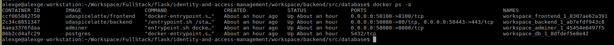
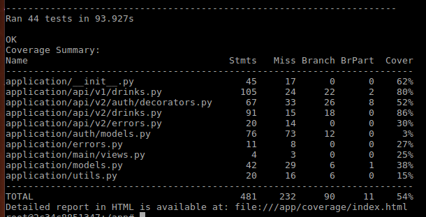

# Udacity Full Stack Development Nanodegree

This is the **capstone project** of Udacity's Full Stack Development Nanodegree

---

## Up & Running

### Build Images

The building of frontend would take some time because of npm install. Grab a coffee and have a break before you continue!

```bash
docker-compose build
```

### Initialize Database

#### Identify Backend Instance

First, identify backend instance by typing the following command. Select the one whose name contains **backend**

```bash
docker ps -a
```



#### Restore Database

Then, enter the instance and initialize DB data by typing:

```bash
# enter backend instance:
docker exec -it workspace_backend_1_ab7efdf943c8 bash
# init db:
flask init-db
```

### Check Host Ports

Make sure the following ports are not used on local host:
* **localhost:58100** This port will be used by frontend APP
* **localhost:50080** This port will be used by backend for easy debugging
* **localhost:58080** This port will be used by PG adminer for easy database administration

### Launch

Launch the system using docker-compose. Note: 

* The frontend and the backend will communicate using host network
* The backend will communicate with PGSQL DB using docker compose internal network

```bash
docker-compose up
```

---

## API Endpoints


---

## Testing

### Overview

All the 5 API endpoints are covered by test cases. For the drinks resource, the coverage rate is 86%. See [Python Unittest Testcases](workspace/backend/tests) and [POSTman Testcases](workspace/backend/tests/postman) for details.

### Python Unittest Up & Running

First, identify backend instance by typing the following command. Select the one whose name contains **backend**

```bash
docker ps -a
```


Then, enter the instance and execute the tests by typing:

```bash
# enter backend instance:
docker exec -it workspace_backend_1_ab7efdf943c8 bash
# run tests:
flask test
```

Test coverage analysis is also enabled. Use the following command to get the coverage analysis report:
```bash
# inside backend instance, type:
flask test --coverage=True
```



### POSTman Testcases Up & Running

The test runner and the results for the three roles(public, barista and manager) are all kept in [POSTman Testcases](workspace/backend/tests/postman)

---

## Review

### Data Modeling

#### Architect Relational Database Models in Python

* Use of correct data types for fields
* Use of primary and optional foreign key ids

#### Utilize SQLAlchemy to Conduct Database Queries

* Does not use raw SQL or only where there are not SQLAlchemy equivalent expressions
* Correctly formats SQLAlchemy to define models
* Creates methods to serialize model data and helper methods to simplify API behavior such as insert, update and delete.

### API Architecture and Testing

#### Follow RESTful Principles of API Development

* RESTful principles are followed throughout the project, including appropriate naming of endpoints, use of HTTP methods GET, POST, and DELETE
* Routes perform CRUD operations

#### Structure Endpoints to Respond to Four HTTP methods with Error Handling

* Specifies endpoints and behavior for at least:
    - Two GET requests
    - One POST request
    - One PATCH request
    - One DELETE request
* Utilize the @app.errorhandler decorator to format error responses as JSON objects for at least four different status codes

#### Enable Role Based Authentication and Roles-Based Access Control (RBAC) in a Flask application

* Project includes a custom @requires_auth decorator that:
    * Get the Authorization header from the request
    * Decode and verify the JWT using the Auth0 secret
    * Take an argument to describe the action, i.e. @require_auth(‘create:drink’)
    * Raise an error if:
        - The token is expired
        - The claims are invalid
        - The token is invalid
        - The JWT doesn’t contain the proper action
* Project includes at least two different roles that have distinct permissions for actions. These roles and permissions are clearly defined in the project README. Students can reference the Casting Agency Specs in the Specifications section of this rubric as an example.

#### Demonstrate Validity of API Behavior

* Includes at least one test for expected success and error behavior for each endpoint using the unittest library
* Includes tests demonstrating role-based access control, at least two per role.

### Third-Party Authentication

#### Configure Third-Party Authentication Systems

Auth0 is set up and running at the time of submission. All required configuration settings are included in a bash file which export:

- The Auth0 Domain Name
- The JWT code signing secret
- The Auth0 Client ID

#### Configure Roles-Based Access Control (RBAC)

* Roles and permission tables are configured in Auth0.
* Access of roles is limited. Includes at least two different roles with different permissions.
* The JWT includes the RBAC permission claims.

### Deployment

#### Application is Hosted Live at Student Provided URL

* API is hosted live via Heroku
* URL is provided in project README
* API can be accessed by URL and requires authentication

#### Includes Instructions to Set Up Authentication

Instructions are provided in README for setting up authentication so reviewers can test endpoints at live application endpoint

### Code Quality & Documentation

#### Write Clear, Concise and Well Documented Code

#### Project Demonstrates Reliability and Testability

#### Project Demonstrates Maintainability

#### Project Includes Thorough Documentation


