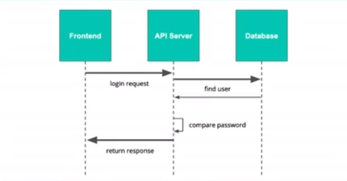

# Udacity Full Stack Development Nanodegree

This is the lecture notes for Identity and Access Management of Udacity's Full Stack Development Nanodegree

---

## Authentication

### Related HTTP Codes

* **401 Unauthorized**

The client must pass authentication before access to this resource is granted. The server cannot validate the identity of the requested party.

* **403 Forbidden**

The client does not have permission to access the resource. Unlike 401, the server knows who is making the request, but that requesting party has no authorization to access the resource.

### Password-Based Authentication

#### Overview

#### Potential Risks

* **User Perspective**
    * For security reasons strong password should be used. However, users forget their passwords
    * Users use simple passwords
    * Users use common passwords
    * Users repeat passwords
    * Users share passwords

* **Developer Pespective** Security is a topic needs special expertise
    * Passwords can be compromised
    * Developers can incorrectly check
    * Developers can cut corners

### Token-Based Authentication

#### JSON Web Token (JWT)

* **Stateless** Good for micro-services architecture and scalability
* **Cross-Platform** Can be easily implemented and used across different platforms
* **Flexible** Easily extensible

#### Data Strucure

* **Header** Base64 encoding
* **Payload** Base64 encoding
* **Signature** Used for verification

#### Debugging Tool

[JWT](https://jwt.io/#debugger-io)

### Delegated Authentication Service

#### Auth0

---

## Authorization

### Permissions

Permission usually consists of a verb and a noun as [VERB]:[NOUN]. It represents a specific action in the system.
    * **NOUN** usually represents a resource inside the system
    * **VERB** usually represents an action on the resource

### Roles

Permissions are usually organized as roles. Usually the more one role is associated with the user, the less permissions the role will have.

